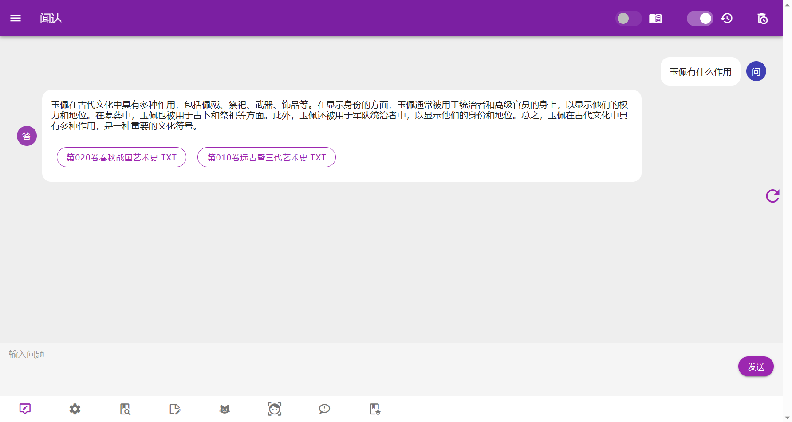

# 闻达：一个大规模语言模型调用平台
<!--ts-->
* [闻达：一个大规模语言模型调用平台](#闻达一个大规模语言模型调用平台)
   * [简介](#简介)
   * [安装部署](#安装部署)
      * [懒人包](#懒人包)
      * [自行安装](#自行安装)
         * [1.安装库](#1安装库)
         * [2.下载模型](#2下载模型)
         * [3.参数设置](#3参数设置)
   * [Auto](#auto)
   * [知识库](#知识库)
      * [st模式](#st模式)
      * [fess模式](#fess模式)
         * [win系统](#win系统)
         * [linux系统](#linux系统)
      * [调试工具](#调试工具)
      * [使用](#使用)
   * [模型配置](#模型配置)
      * [chatGLM-6B](#chatglm-6b)
      * [chatRWKV](#chatrwkv)
         * [生成小说](#生成小说)
         * [文字冒险游戏](#文字冒险游戏)
      * [llama](#llama)
* [基于本项目的二次开发](#基于本项目的二次开发)
   * [<a href="https://github.com/AlanLee1996/wenda-webui">wenda-webui</a>](#wenda-webui)

<!-- Created by https://github.com/ekalinin/github-markdown-toc -->
<!-- Added by: runner, at: Sat Apr 29 01:25:22 UTC 2023 -->

<!--te-->
## 简介
一个LLM调用平台。旨在通过使用为小模型外挂知识库查找的方式，实现近似于大模型的生成能力。
1. 目前支持模型：`chatGLM-6B`、`chatRWKV`、`chatYuan`、`llama系列`以及openai的api和chatglm130b api。
2. 知识库扩展模型能力
3. 支持参数在线调整
4. 支持`chatGLM-6B`、`chatRWKV`、`llama系列`流式输出和输出过程中中断
5. 自动保存对话历史至浏览器（多用户同时使用不会冲突，`chatRWKV`历史消息实现方式需使用string）
6. 对话历史管理（删除单条、清空）
7. 支持局域网、内网部署和多用户同时使用。
8. 多用户同时使用中会自动排队，并显示当前用户。

**欢迎同学们制作教学视频、懒人包等，做好请和我联系，我会把相关链接加到readme里**

**交流QQ群：LLM使用和综合讨论群162451840；知识库使用讨论群241773574；Auto开发交流群744842245**

建议在[论坛](https://github.com/l15y/wenda/discussions)中讨论


## 安装部署
### 懒人包
链接：https://pan.baidu.com/s/105nOsldGt5mEPoT2np1ZoA?pwd=lyqz 

视频教程：https://www.bilibili.com/video/BV1aX4y1z7ar/?vd_source=629edb00375d46ad4097acdc7cbc0ca3

提取码：lyqz

[网友制作的autodl整合包](https://www.codewithgpu.com/i/l15y/wenda/Wenda-ChatGLM-Vincuna)

默认参数在GTX1660Ti（6G显存）上运行良好。
1. 旧版包含程序主体和chatGLM-6B、chatYuan，分别是独立的压缩文件。
2. chatRWKV模型更新频繁，请去官方链接下最新的。暂不支持chatPDF功能，很快就加上。
3. 新版暂时只有chatGLM-6B，但重新制作，体积更新，包含各种优化，集成知识库功能，推荐使用。
### 自行安装
#### 1.安装库
通用依赖：```pip install -r requirements.txt```
根据使用的 [知识库](#知识库)进行相应配置

#### 2.下载模型
根据需要，下载对应模型。

建议使用chatRWKV的RWKV-4-Raven-7B-v10x，或chatGLM-6B。

#### 3.参数设置
根据`config.xml`中说明，填写你的模型下载位置等信息
## Auto


[auto例程](https://github.com/l15y/wenda/tree/main/autos)

## 知识库
知识库原理是生成一些提示信息，会插入到对话里面。


fess模式、bing模式均调用搜索引擎搜索获取答案。

搜索后在回答之前插入提示信息，知识库的数据就被模型知道了。

为防止爆显存，插入的数据不能太长，所以有字数限制。

有以下几种方案：
1.   st模式，sentence_transformers+faiss进行索引
2.   bing模式，cn.bing搜索，仅国内可用
3.   rtst模式，sentence_transformers+faiss进行索引。但构建方式为在线进行，支持多索引库切换
4.   fess模式，本地部署的[fess搜索](https://github.com/codelibs/fess)，并进行关键词提取
5.   mix模式，融合
### st模式
sentence_transformers+faiss进行索引、匹配，并连同上下文返回，相当于原先x模式升级版。

构建索引运行：plugins/buils_ST_data.bat。

Linux直接使用wenda环境执行```python plugins/gen_data_st.py```

需下载模型[GanymedeNil/text2vec-large-chinese](https://huggingface.co/GanymedeNil/text2vec-large-chinese)置于model文件夹，并将txt格式语料置于txt文件夹。

TODO：在线语料上传、根据字数灵活提供上下文、根据上下文相关性提供上下文。
### fess模式
#### win系统
1. 懒人包中下载fess-14.7.0-with-jdk.7z
2. 解压到平时放软件的盘
3. 打开解压出来的fess-14.7.0-with-jdk\bin目录
4. 双击fess.in.bat
5. 双击fess.bat. 弹出命令行运行框. 将其最小化
6. 打开浏览器. 打开网址http://localhost:8080/
7. 点击右上角log in  输入账号:admin 密码：wenda 进行登录
8. 点击侧边栏中的Crawler. 点击File System
9. 点击右上角的Create New
10. Name输入便于记忆的资料库的名字
11. Paths输入资料库的地址（格式示例：file:///E:/pdf）
12. 其余选项保持默认. 下滚至最下方点击Create
13. 自动返回File System页面. 点击刚才创建的选项（自己输入的Name）
14. 点击Create new job. 点击Create
15. 进入侧边栏的System内的Scheduler. 可以看到很多任务
16. 目录的前面可以看到刚刚创建的job（示例：File Crawler - pdf search）. 点击进入
17. 点击Start now. 刷新界面即可看到该任务正在运行. running
18. 此时fess就在爬取文件的名字和内容. 可以在资源管理器看到cpu有负载
19. 挂机。等待爬取完成即可尝试搜索关键词

#### linux系统
1. 安装JDK 
```
wget https://download.java.net/java/17/latest/jdk-17_linux-x64_bin.tar.gz
sudo tar xvf jdk-17_linux-x64_bin.tar.gz -C /usr/local/
```
解压后，JDK 17 将被安装在 /usr/local/jdk-17 目录中。

配置环境变量。要在系统中使用 JDK 17，您需要将其添加到 PATH 环境变量中。您可以使用以下命令将其添加到 /etc/profile 文件中：

```
 rm -f /etc/alternatives/java
 ln -s /usr/local/jdk-17.0.6/bin/java /etc/alternatives/java
     echo export JAVA_HOME=/usr/local/jdk-17.0.6 >>/etc/profile
     echo export PATH='$PATH':'$JAVA_HOME'/bin >>/etc/profile
     echo export CLASSPATH=.:'$JAVA_HOME'/lib/dt.jar:'$JAVA_HOME'/lib/tools.jar >>/etc/profile
     source /etc/profile
```
确认安装。您可以使用以下命令检查 JDK 17 是否已成功安装：
```
java -version
```
如果一切正常，您应该会看到类似以下内容的输出：

openjdk version "17.0.1" 2021-10-19
OpenJDK Runtime Environment (build 17.0.1+12-39)
OpenJDK 64-Bit Server VM (build 17.0.1+12-39, mixed mode, sharing)

2. 安装fess
下载fess
解压fess
```
unzip fess-14.7.0.zip
cd bin
 ./fess -d
```

###  调试工具



### 使用
正常使用中，勾选右上角知识库
##  模型配置
### chatGLM-6B
运行：`run_GLM6B.bat`。

模型位置等参数：修改`config.xml`。

默认参数在GTX1660Ti（6G显存）上运行良好。

### chatRWKV
运行：`run_rwkv.bat`。

模型位置等参数：修改`config.xml`。

默认参数在GTX1660Ti（6G显存）上正常运行，但速度较慢。

#### 生成小说

#### 文字冒险游戏

### llama
运行：`run_llama.bat`。

注意库最好使用我修改的：[llama-cpp-python](https://github.com/l15y/llama-cpp-python)，才可以正常使用中文（截止4月15日）。

编译好的：https://github.com/l15y/llama-cpp-python/releases

模型位置等参数：修改`config.xml`。

# 基于本项目的二次开发
## [wenda-webui](https://github.com/AlanLee1996/wenda-webui)
项目调用闻达的 api 接口实现类似于 new bing 的功能。 技术栈：vue3 + element-plus + ts

[](https://star-history.com/#l15y/wenda&Date)
